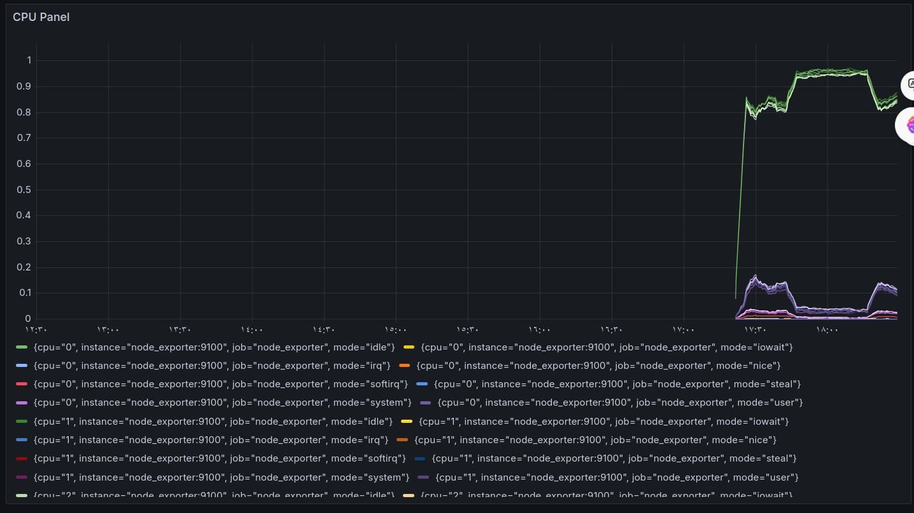
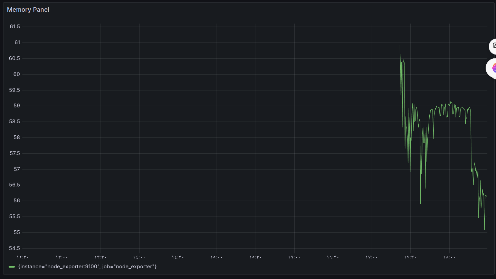
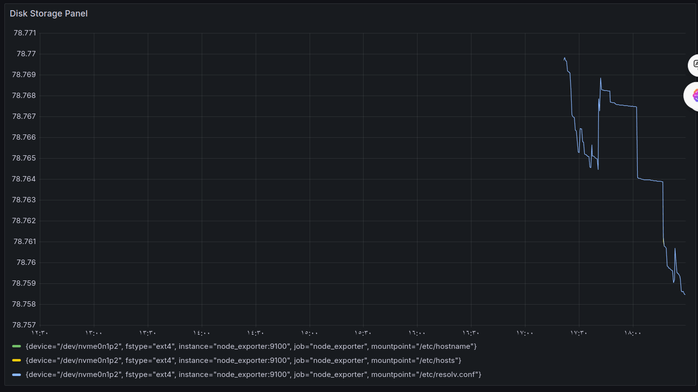

# Infrastructure Monitoring with Prometheus, Node Exporter, and Grafana

## Overview

This project sets up a monitoring system using Prometheus, Node Exporter, and Grafana as Docker containers. The monitoring system collects metrics on CPU, memory, and disk storage, providing a visual dashboard through Grafana.


## Requirements

- Docker
- Docker Compose

## Steps to Create and Run the Monitoring System

### 1. Install Docker and Docker Compose

Ensure you have Docker and Docker Compose installed on your machine. You can download and install them from the official [Docker documentation](https://docs.docker.com/get-docker/).

### 2. Create prometheus configration file
  
   - [prometheus file](prometheus.yml)

### 3. Create docker-compose file
  
   - [compose file](docker-compose.yaml)


### 4. run the docker compose file
     
   - run this command in the root directory  

   ``` 
     docker compose up -d
   ```  

### 5. Check prometheus if run or not

   - open the Browser and browse for this url

      - http://localhost:9090

      if the UI loaded then the prometheus run successfully if not check the logs for its container


### 6. open the Grafana
 
  1. open the Browser and browse for this url

      - http://localhost:3000
 
  2. navigate to the data source
    - connection -> data source -> choose prometheus
    - put the url for the prometheus to connect with it
    - click on save and test button


  3. create dashboard 
     - put in the select metrics your promQL and run it , this output visualization you can save it 
      like this images

      ## CPU Panel
       

      ## Memory Panel
       

      ## Disk Storage Panel
       

    

